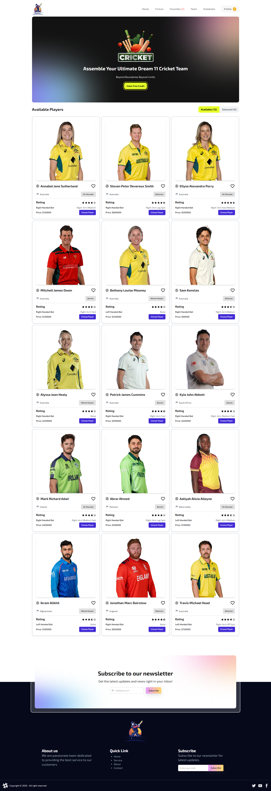

# 🏏 Cricketers Den

Welcome to **Cricketers Den** – a sleek React-based application where users can build their dream cricket team by selecting players under a coin budget system. Designed with interactivity and smooth user experience in mind, this app simulates a player selection interface inspired by fantasy cricket games.

---

## 📸 Preview



---

## 📌 Description

Cricketers Den allows users to:

- Browse available cricket players with rich detail.
- Manage player selection while keeping track of coins.
- Add or remove players from their dream team.
- Enjoy an interactive UI inspired by a Figma design.
- Dynamic rating of each player
- Manage favorite players

It’s a perfect mini-project for React learners to practice state management, conditional rendering, and component architecture.

---

## 🛠️ Technologies Used

- **React.js** – For building user interfaces
- **Vite** – Lightning-fast dev environment
- **Tailwind CSS** – For styling
- **Daisy UI** – For styling
- **JavaScript (ES6)** – Core logic and interactivity
- **JSON** – Static player data

---

## 🚀 Key Features

1. **💰 Coin-Based Player Selection**

   - Add coins via a button and select players based on their bidding price. Smart alerts if funds are insufficient.

2. **🧑‍🤝‍🧑 Dynamic Player Toggle View**

   - Seamlessly switch between _Available_ and _Selected_ players. View player count and details in a clean layout.

3. **🧼 Clean and Responsive UI**
   - Built from scratch to match Figma designs with responsive card layouts, interactive buttons, and styled sections like navbar, banner, and footer.

---

## 📥 Setup Instructions

```bash
git clone https://github.com/raitulsams/cricketers-den.git
cd cricketers-den
npm install
npm run dev
```
